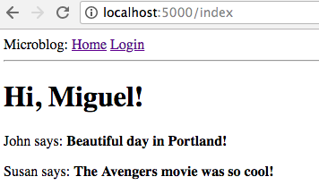
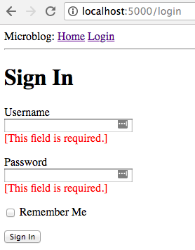
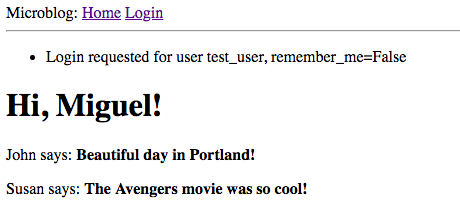

# microblog
Going through Miguel Grinberg's Flask Tutorial as a refresher

# This Section Covers
- Web Forms
- Flask WTF
- Flask WTF Validation
- Basic (dummy) Login page to learn about forms
- SECRET_KEYs

# Useful Images

